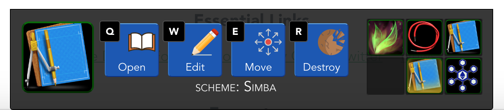
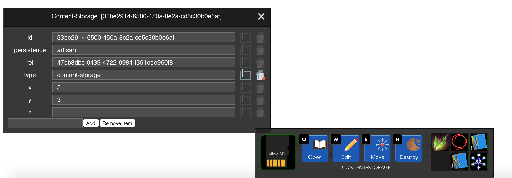
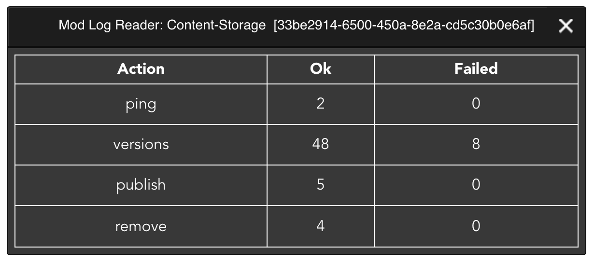
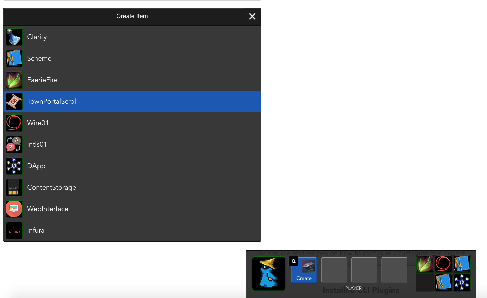

# План разработки DAppsMaster, платформы для управления децентрализованными приложениями

## Исходные данные

Для управление DApp представлен в DAppsMaster в качестве схемы - набора взаимосвязанных модулей системы DAppsMaster.

Связи между модулями подразумевают взаимодействие самостоятельных модулей друг с другом и условно подразделяются на
3 типа: входящие, исходящие и двунаправленные. Во избежание избыточного количества связей и запутанной структуры 
приложения, следующие случаи не должны быть связями на схеме DAppsMaster:

- Включённость модуля в другой модуль (например, связь отдельного виджета и Web-интерфейса подразумевается, но не
  обозначается связью на схеме)
- Связь модуля с библиотеками общего назначения (например, библиотеки moment.js или BigNumber могут использоваться
  различными модулями, эти связи не обознаются явно и не логируются DAppsMaster)
- Работа модулей с API и сервисами самой платформы DAppsMaster также происходит без обозначения этого на схемах
  (например, обращения к API логирования доступно из различных модулей)
- Взаимодейтствие контрактов между собой может быть представлено связью на схеме, но скорее всего такая связь 
  потребует отдельной реализации для протоколирования и мониторинга её работы, поскольку ни одна из сторон связи не 
  поставляет данных в платформу самостоятельно
- ... возможно какие-то ещё случаи, которые пока трудно сформулировать

Модули платформы DAppsBoss инстанциируются для представления на схемах, каждая инстанция получает UUID. Связи 
адресуются парой UUID взаимодействующих модулей, где `here` будет являться UUID модуля, отправляющего сообщения,
и `there` - UUID принимающего модуля. Взаимодействие описывается следующими данными, которые попадают в лог системы:

`idScheme` - ID схемы, в рамках которых происходит взаимодействие
`here`
`there`
`action` - название операции, например "ping"
`code` - код возврата: "ok" - успешно, что-то иное в случае ошибки (обычно "fail", но доступно любое количество кодов)
`dt` - UNIX timestamp момента взаимодействия
`payload` - любые данные в JSON, отправляемые вызывающим модулем
`response` - любые данные в JSON, отправляемые в ответ
`server` - IP адрес сервера, который обслуживает вызов; это поле остаётся в значении 0.0.0.0, если взаимодействие 
            происходит не на стороне сервера (например, внутри браузера)
`endpoint` - URL конечной точки, к которой обращается вызывающий модуль (если используется HTTP)

Кроме того, модуль логирует свои внутренние операции, но вместо полей `here` и `there` записывается `idModule` (UUID).

## Интерфейс

DAppsMaster реализует и использует объекты Zel как основу для модулей и объектов под управлением модулей. Центральным
элементом навигации выступает нижняя панель, которая обеспечивает:

- идентификацию выбранного объекта (иконка, класс, имя; например "Scheme: Rox");
- кнопки основных действий, которые можно выполнять с этим объектом (например "Open", "Edit", "Move", "Destroy"); 
  поддерживается до 7 основных действий, и они закрепляются за горячими клавишами от "Q" до "U"; горячие клавиши 
  блокируются, если активно какое-либо поле ввода;
- "инвентарь" - лоток на 6 ячеек для размещения объектов для быстрого доступа к ним, также используется как место для
  создания новых объектов и как буфер для перемещения объектов между различными контейнерами (например, схемами).
- горячая клавиша 'ESC' позволяет снять фокус с выбранного объекта, фокус переходит к объекту, символизирующему
  учётную запись текущего пользователя ("Player").
  

Интерфейсы модулей, сторого говоря, могут быть выполнены как угодно - в виде виджетов, блоков, страниц, диалогов,
панелей с дэшбордами, но пока реализованы в виде простейших виджетов 4 интерфейса:

- схема (частично, и немного потеряла в функциональности при перезапуске проекта на Vuex);
- редактор объектов (универсальный редактов объектов Zel, позволяет изменять данные объекта, в том числе в JSON
  формате, с горячим реактивным сохранением во Vuex – нуждается в небольших доработках в части поддержки JSON);

- log viewer (по сути демка с подсчётом логированных операций, сгруппированных по коду возврата);

- создание объктов (тоже демка, создаются объекты, не нужающиеся в исходных данных).

## Интеграция с кодом

Схема DAppsMaster в её JSON-представлении является отправной точкой для предоставления программному коду библиотек 
и интерфейсов, через которые модули будут логировать свои операции и взаимодействовать друг с другом. На данный момент
используется нулевая инфраструктура для доставки JSON схемы, то есть JSON схемы просто выгружается из схемы в исходный
код проекта вручную. В дальнейшем могут быть предложены какие-то инфраструктурные решения в этой части, но в целом
операция изменения схемы без соответствующих изменений в коде модулей выглядит как утопия. Кроме того, нулевая
инфраструктура даёт высокий уровень безопасности по цене обычного разграничения прав на управление репозиториями.

Разработано несколько версий библиотеки DAppsMaster для Vue/Vuex и NodeJS, которые на основании схемы предоставляют
классы DAMLink и DAMModule, через которые прикладной код может вызывать непосредственно действия (actions) в модулях, 
не выясняя, на каком сервере и на каком endpoint'е будут обслуживаться эти действия, и также все эти вызовы будут 
логироваться DAppsMaster автоматически.

Через эти библиотеки взаимодействуют редактор, хранилище контента на DAppsBoss и Web-интерфейсы проектов NTS ICO,
NTS, хотя JSON-файлы схемы для них написаны вручную.

## Основные векторы разработки платформы

- интерфейс: в первую очередь нужны универсальные инструменты для работы с объектами (в т.ч. модулями), 
  полнофункциональный редактор схемы с возможностью подробного и сводного изучения логов над связями и модулями,
  инструменты для фонового мониторинга схемы и оперативного оповещения о проблемах;
- рабочий стол: система управления виджетами могла бы сократить дальнейшие затраты времени на вёрстку и поведение
  стандартных виджетов, также можно прийти к сохраняемым рабочим столам;
- хранение: на данный момент DAppsMaster использует localStorage в качестве хранилища объектов; это может оставаться
  так, или быть пересмотрено в пользу централизованных или децентрализованных хранилищ (наиболее перспективным выглядит
  GUN в связке с WebRTC, а также самостоятельная разработка хранилища на базе тестовой сети Rinkeby); в ветке с
  продолжением использования localStorage приобретает смысл разработка протокола межпользовательского взаимодействия;
- универсальные инструменты для работы с Ethereum - библиотека смарт-контрактов, генератор смарт-контрактов, 
  компиляция кода Solidity и деплой без использования Remix; универсальный инструмент для выполнения произвольных
  транзакций; универсальный инструмент для подбора событий из blockchain;
- прикладное направление (описывается подробно в текущем Roadmap проекта);
- разработка эффективной методики интеграции DAppsMaster с уже работающими DApps, в то числе с их серверной частью,
  смарт-контрактами, хранилищами событий, и, возможно, с Web-интерфейсами;
- аналитические и статистические инструменты двух видов 1) для более полного понимания работы конечных пользователей с
  DApps и 2) для среднесрочного планирования разработки самой платформы, DApps, и панелей управления.
