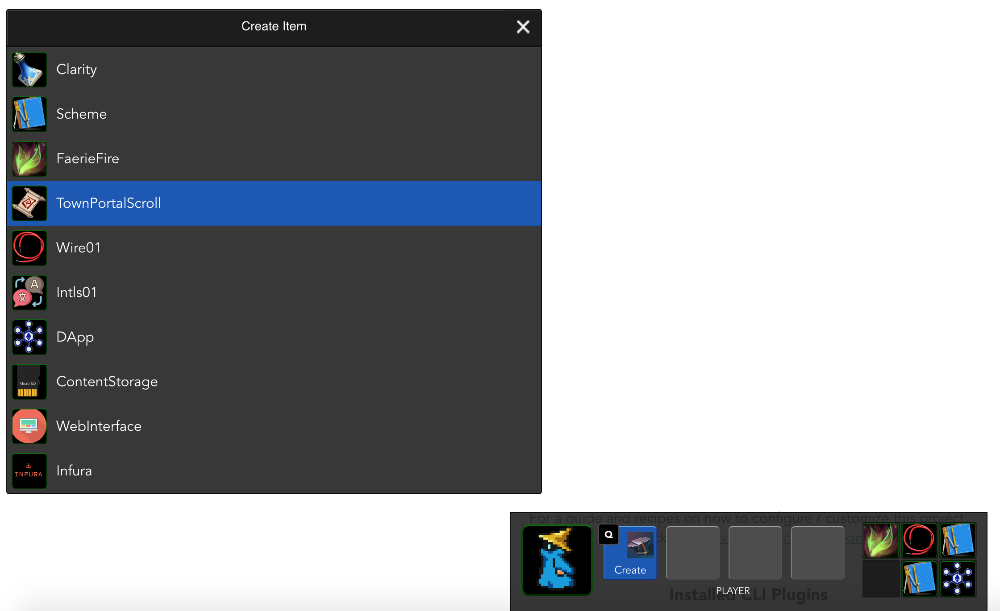

# План разработки DAppsMaster, платформы для управления децентрализованными приложениями

## Исходные данные

Для управление DApp представлен в DAppsMaster в качестве схемы - набора взаимосвязанных модулей системы DAppsMaster.

Связи между модулями подразумевают взаимодействие самостоятельных модулей друг с другом и условно подразделяются на
3 типа: входящие, исходящие и двунаправленные. Во избежание избыточного количества связей и запутанной структуры 
приложения, следующие случаи не должны быть связями на схеме DAppsMaster:

- Включённость модуля в другой модуль (например, связь отдельного виджета и Web-интерфейса подразумевается, но не
  обозначается связью на схеме)
- Связь модуля с библиотеками общего назначения (например, библиотеки moment.js или BigNumber могут использоваться
  различными модулями, эти связи не обознаются явно и не логируются DAppsMaster)
- Работа модулей с API и сервисами самой платформы DAppsMaster также происходит без обозначения этого на схемах
  (например, обращения к API логирования доступно из различных модулей)
- Взаимодейтствие контрактов между собой может быть представлено связью на схеме, но скорее всего такая связь 
  потребует отдельной реализации для протоколирования и мониторинга её работы, поскольку ни одна из сторон связи не 
  поставляет данных в платформу самостоятельно
- ... возможно какие-то ещё случаи, которые пока трудно сформулировать

Модули платформы DAppsBoss инстанциируются для представления на схемах, каждая инстанция получает UUID. Связи 
адресуются парой UUID взаимодействующих модулей, где `here` будет являться UUID модуля, отправляющего сообщения,
и `there` - UUID принимающего модуля. Взаимодействие описывается следующими данными, которые попадают в лог системы:

`idScheme` - ID схемы, в рамках которых происходит взаимодействие
`here`
`there`
`action` - название операции, например "ping"
`code` - код возврата: "ok" - успешно, что-то иное в случае ошибки (обычно "fail", но доступно любое количество кодов)
`dt` - UNIX timestamp момента взаимодействия
`payload` - любые данные в JSON, отправляемые вызывающим модулем
`response` - любые данные в JSON, отправляемые в ответ
`server` - IP адрес сервера, который обслуживает вызов; это поле остаётся в значении 0.0.0.0, если взаимодействие 
            происходит не на стороне сервера (например, внутри браузера)
`endpoint` - URL конечной точки, к которой обращается вызывающий модуль (если используется HTTP)

Кроме того, модуль логирует свои внутренние операции, но вместо полей `here` и `there` записывается `idModule` (UUID).

## Интерфейс

DAppsMaster реализует и использует объекты Zel как основу для модулей и объектов под управлением модулей. Центральным
элементом навигации выступает нижняя панель, которая обеспечивает:

- идентификацию выбранного объекта (иконка, класс, имя; например "Scheme: Rox");
- кнопки основных действий, которые можно выполнять с этим объектом (например "Open", "Edit", "Move", "Destroy"); 
  поддерживается до 7 основных действий, и они закрепляются за горячими клавишами от "Q" до "U"; горячие клавиши 
  блокируются, если активно какое-либо поле ввода;
- "инвентарь" - лоток на 6 ячеек для размещения объектов для быстрого доступа к ним, также используется как место для
  создания новых объектов и как буфер для перемещения объектов между различными контейнерами (например, схемами).
- горячая клавиша 'ESC' позволяет снять фокус с выбранного объекта, фокус переходит к объекту, символизирующему
  учётную запись текущего пользователя ("Player").
  

Интерфейсы модулей, сторого говоря, могут быть выполнены как угодно - в виде виджетов, блоков, страниц, диалогов,
панелей с дэшбордами, но пока реализованы в виде простейших виджетов 4 интерфейса:

- схема (частично, и немного потеряла в функциональности при перезапуске проекта на Vuex);
- редактор объектов (универсальный редактов объектов Zel, позволяет изменять данные объекта, в том числе в JSON
  формате, с горячим реактивным сохранением во Vuex – нуждается в небольших доработках в части поддержки JSON);

- log viewer (по сути демка с подсчётом логированных операций, сгруппированных по коду возврата);

- создание объктов (тоже демка, создаются объекты, не нужающиеся в исходных данных).

